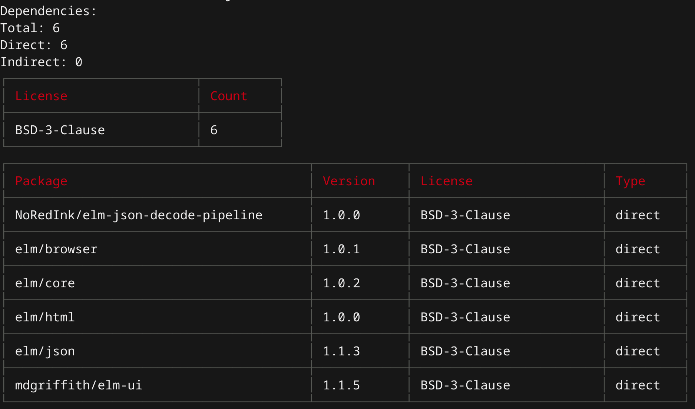

# Elm License Finder

A simple node app for collecting license information for Elm dependencies. Gives you:

- Total dependency count
- Portion of dependencies that are direct
- Portion of dependencies that are indirect
- Totals of licenses by name
- Table of package, version, license, and whether it's a direct or indirect dependency

\*_For packages, all dependencies are direct._



---

## Use as a command:

- Run `yarn global add elm-license-finder` or `npm install -g elm-license-finder`
- Navigate to the directory with your `elm.json`
- Run `elm-license-finder`

## Use as a module:

Run `yarn add elm-license-finder` or `npm install elm-license-finder`

```
const elmLicenseFinder = require("elm-license-finder");

const dependencies = elmLicenseFinder();
// returns an object with the structure:
// {
//   "package/name": {
//     version: "1.2.3",
//     license: "MIT",
//     type: "direct",
//   }
// }
```

If you're running it from a different directory than the one with `elm.json` in it

```
const elmLicenseFinder = require("elm-license-finder");
const path = require("path");

const dependencies = elmLicenseFinder(path.resolve("path", "to", "elm", "project"));
```
